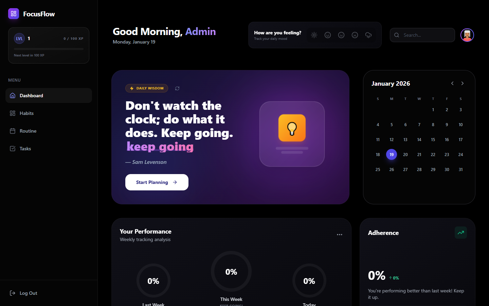
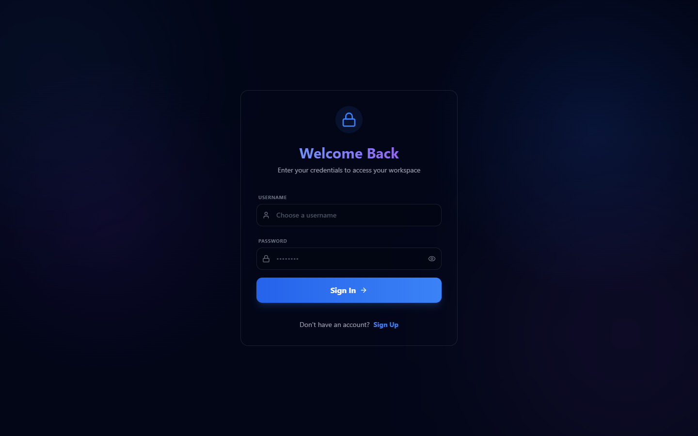
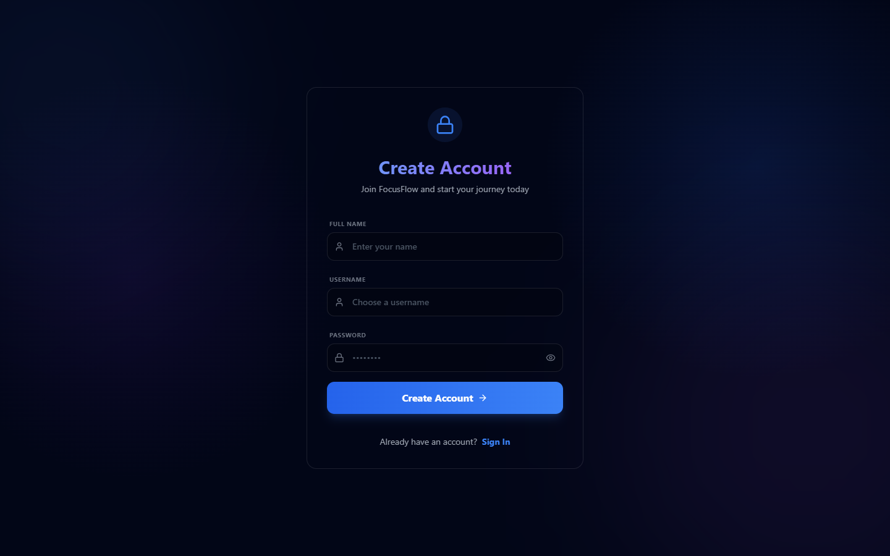
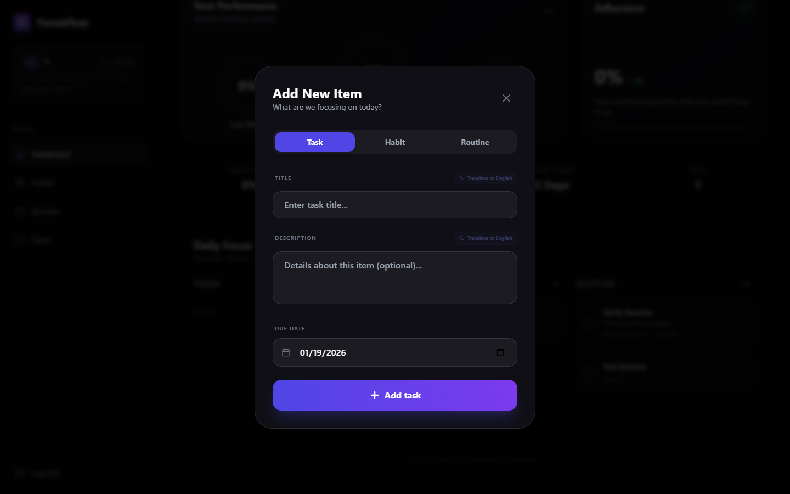
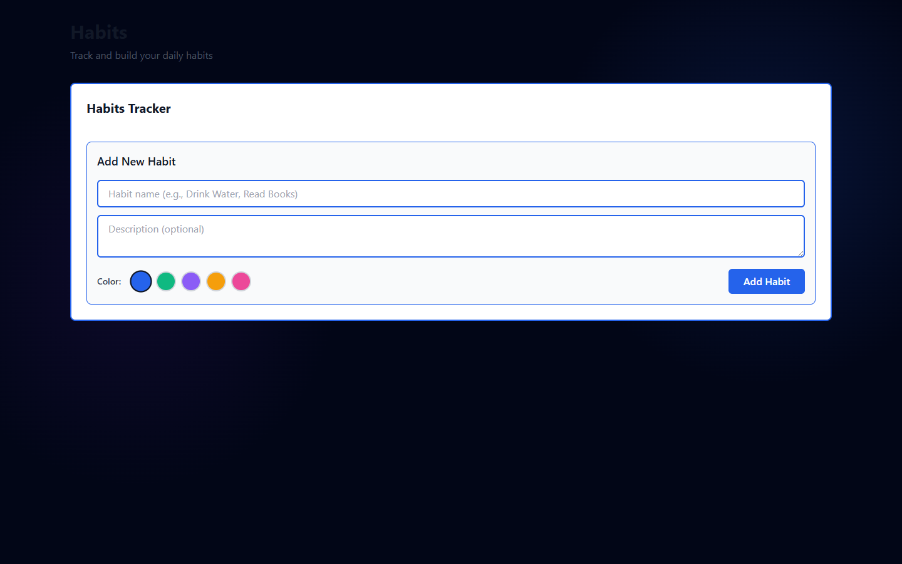

# Habit Tracker Dashboard

A comprehensive, premium habit tracking application built with Next.js and Tailwind CSS.

## Screenshots

<div align="center">
  
</div>

| Sign In | Sign Up |
|:---:|:---:|
|  |  |

| Add New Item (Translate) | Habits View |
|:---:|:---:|
|  |  |

## Features

- **📊 Dashboard Overview**: View progress for habits, tasks, and routines in a unified 3-column layout.
- **✨ AI Translation**: Integrated "Magic Translate" feature. Type in Hindi, Marathi, or Hinglish, and instantly convert to English!
- **📅 Daily Routine Tab**: Track daily routines with time-based scheduling.
- **✅ Tasks Management**: Manage tasks with priorities and due dates.
- **🔥 Habits Tracking**: Track habits with streak counters and progress visualization.
- **🔒 Secure Authentication**: Robust Login and Signup with user session management.
- **💾 Database Persistence**: Uses Prisma with SQLite (dev) / Postgres (prod) for reliable data storage.

## Getting Started

1. Install dependencies:
```bash
npm install
```

2. Initialize the database:
```bash
npx prisma generate
npx prisma db push
node scripts/seed-user-data.js # Optional: Add dummy data
```

3. Run the development server:
```bash
npm run dev
```

4. Open [http://localhost:3000](http://localhost:3000)

## Tech Stack

- Next.js 14 (App Router)
- React 18
- TypeScript
- Tailwind CSS
- Prisma (ORM)
- Framer Motion (Animations)
- Lucide React (Icons)


